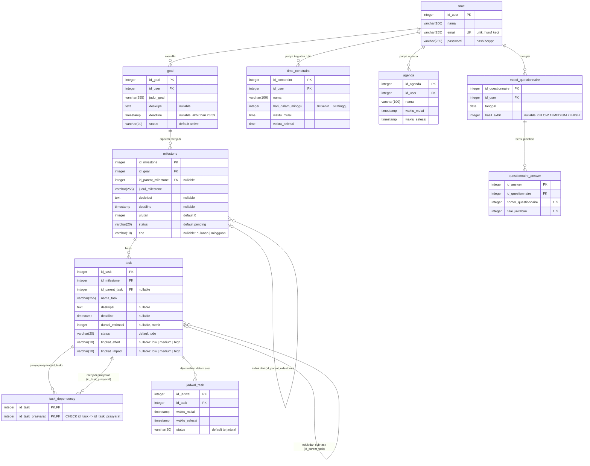

# ERD v2 — GradaTim

Dokumen ini disusun langsung dari model SQLAlchemy di `backend/app/models/` dan migrasi
`backend/alembic/versions/bc925661c16c_initial_schema_from_erd_v2.py` (10 tabel). Jadikan sumber saat
menggambar ulang diagram ERD. Setiap kolom di bawah sudah dicek terhadap `Base.metadata`.

Konvensi:

- Tipe ditulis sesuai SQLAlchemy/PostgreSQL: `integer`, `varchar(n)`, `text`, `timestamp` (= `DateTime`,
  **tanpa timezone**, selalu waktu lokal WIB), `date`, `time`.
- Semua primary key tunggal adalah `integer` auto-increment (`SERIAL` di PostgreSQL) dan ber-index.
- Semua foreign key ber-index, **kecuali** `task_dependency.id_task` (sudah tercakup sebagai kolom pertama
  primary key komposit).
- Penghapusan berantai (cascade) diatur di ORM (`cascade="all, delete-orphan"`), bukan `ON DELETE` di
  database: menghapus user → goal, kegiatan rutin, agenda, kuesioner ikut terhapus; menghapus goal →
  milestone → task → `task_dependency` & `jadwal_task` ikut terhapus.
- Kolom status berupa string biasa (bukan Enum DB); nilai yang sah ada di `app/core/status.py`.

## Diagram

Kardinalitas: `user 1–N goal`, `goal 1–N milestone`, `milestone 1–N milestone` (parent, opsional),
`milestone 1–N task`, `task 1–N task` (sub-task, opsional), `task N–N task` lewat `task_dependency`,
`task 1–N jadwal_task`, `user 1–N time_constraint`, `user 1–N agenda`, `user 1–N mood_questionnaire`,
`mood_questionnaire 1–N questionnaire_answer`.

## Tabel per entitas

### `user`

| Kolom | Tipe | Nullable | Arti |
| --- | --- | --- | --- |
| `id_user` | integer, PK | tidak | ID pengguna |
| `nama` | varchar(100) | tidak | Nama tampilan |
| `email` | varchar(255), unik, index | tidak | Email login, disimpan huruf kecil |
| `password` | varchar(255) | tidak | Hash bcrypt (bukan plaintext) |

### `goal`

| Kolom | Tipe | Nullable | Arti |
| --- | --- | --- | --- |
| `id_goal` | integer, PK | tidak | ID goal |
| `id_user` | integer, FK → `user.id_user` | tidak | Pemilik goal |
| `judul_goal` | varchar(255) | tidak | Target besar yang ditulis user |
| `deskripsi` | text | ya | Penjelasan tambahan |
| `deadline` | timestamp | ya | Tenggat; tanggal dari user disimpan sebagai 23:59 hari itu. API mewajibkannya, tetapi kolomnya nullable |
| `status` | varchar(20) | tidak | Default `active` (`GOAL_ACTIVE`); nilai lain belum disepakati |

### `milestone`

| Kolom | Tipe | Nullable | Arti |
| --- | --- | --- | --- |
| `id_milestone` | integer, PK | tidak | ID milestone |
| `id_goal` | integer, FK → `goal.id_goal` | tidak | Goal induk |
| `id_parent_milestone` | integer, FK → `milestone.id_milestone` | ya | Milestone induk (target mingguan di bawah target bulanan); NULL = level teratas |
| `judul_milestone` | varchar(255) | tidak | Judul milestone |
| `deskripsi` | text | ya | Penjelasan |
| `deadline` | timestamp | ya | Tenggat; saat dekomposisi = deadline task terakhir di milestone itu |
| `urutan` | integer | tidak | Urutan di antara milestone dengan induk yang sama (default 0) |
| `status` | varchar(20) | tidak | Default `pending` (belum disepakati tim) |
| `tipe` | varchar(10) | ya | `bulanan` / `mingguan` / NULL (milestone biasa, seperti output AI saat ini) |

### `task`

| Kolom | Tipe | Nullable | Arti |
| --- | --- | --- | --- |
| `id_task` | integer, PK | tidak | ID task |
| `id_milestone` | integer, FK → `milestone.id_milestone` | tidak | Milestone induk |
| `id_parent_task` | integer, FK → `task.id_task` | ya | Hierarki sub-task (bukan prasyarat) |
| `nama_task` | varchar(255) | tidak | Judul task |
| `deskripsi` | text | ya | Penjelasan |
| `deadline` | timestamp | ya | Tenggat; dari AI = hari ini + (`day_number` − 1) hari, pukul 23:59 |
| `durasi_estimasi` | integer | ya | Perkiraan durasi (menit) |
| `status` | varchar(20) | tidak | `todo` (default) / `in_progress` / `done` |
| `tingkat_effort` | varchar(10) | ya | `low` / `medium` / `high` — usaha yang dibutuhkan (FR-7, FR-9) |
| `tingkat_impact` | varchar(10) | ya | `low` / `medium` / `high` — dampak ke goal (FR-9) |

### `task_dependency`

| Kolom | Tipe | Nullable | Arti |
| --- | --- | --- | --- |
| `id_task` | integer, PK + FK → `task.id_task` | tidak | Task yang menunggu |
| `id_task_prasyarat` | integer, PK + FK → `task.id_task`, index | tidak | Task yang harus selesai lebih dulu |

Primary key komposit `(id_task, id_task_prasyarat)`; constraint
`ck_task_dependency_bukan_diri_sendiri`: `id_task <> id_task_prasyarat`.

### `jadwal_task`

| Kolom | Tipe | Nullable | Arti |
| --- | --- | --- | --- |
| `id_jadwal` | integer, PK | tidak | ID sesi |
| `id_task` | integer, FK → `task.id_task` | tidak | Task yang dikerjakan di sesi ini (satu task boleh beberapa sesi) |
| `waktu_mulai` | timestamp | tidak | Mulai sesi (WIB) |
| `waktu_selesai` | timestamp | tidak | Selesai sesi (WIB) |
| `status` | varchar(20) | tidak | `terjadwal` (default) / `selesai` / `dilewati`. Sesi terlewat tidak dihapus: jadi `dilewati` dan dibuat sesi baru |

### `time_constraint` (kegiatan rutin mingguan)

| Kolom | Tipe | Nullable | Arti |
| --- | --- | --- | --- |
| `id_constraint` | integer, PK | tidak | ID kegiatan rutin |
| `id_user` | integer, FK → `user.id_user` | tidak | Pemilik |
| `nama` | varchar(100) | tidak | Nama kegiatan (Kuliah, Gym, ...) |
| `hari_dalam_minggu` | integer | tidak | 0 = Senin … 6 = Minggu (sama dengan `date.weekday()`) |
| `waktu_mulai` | time | tidak | Jam mulai |
| `waktu_selesai` | time | tidak | Jam selesai; lebih kecil dari `waktu_mulai` = melewati tengah malam |

### `agenda` (acara sekali jalan)

| Kolom | Tipe | Nullable | Arti |
| --- | --- | --- | --- |
| `id_agenda` | integer, PK | tidak | ID agenda |
| `id_user` | integer, FK → `user.id_user` | tidak | Pemilik |
| `nama` | varchar(100) | tidak | Nama acara |
| `waktu_mulai` | timestamp | tidak | Mulai (WIB) |
| `waktu_selesai` | timestamp | tidak | Selesai (WIB), wajib di tanggal yang sama dengan `waktu_mulai` |

### `mood_questionnaire`

| Kolom | Tipe | Nullable | Arti |
| --- | --- | --- | --- |
| `id_questionnaire` | integer, PK | tidak | ID pengisian kuesioner |
| `id_user` | integer, FK → `user.id_user` | tidak | Pengisi |
| `tanggal` | date | tidak | Tanggal pengisian |
| `hasil_akhir` | integer | ya | `MoodAssessment.capacity_index`: 0 = LOW, 1 = MEDIUM, 2 = HIGH |

### `questionnaire_answer`

| Kolom | Tipe | Nullable | Arti |
| --- | --- | --- | --- |
| `id_answer` | integer, PK | tidak | ID jawaban |
| `id_questionnaire` | integer, FK → `mood_questionnaire.id_questionnaire` | tidak | Kuesioner induk |
| `nomor_questionnaire` | integer | tidak | Pertanyaan ke-1..5: fokus, tenang, motivasi, tidur, siap |
| `nilai_jawaban` | integer | tidak | Skala 1–5 |

## Nilai status (`app/core/status.py`)

| Konstanta | Nilai | Dipakai di |
| --- | --- | --- |
| `TASK_TODO` | `todo` | `task.status` (default) |
| `TASK_IN_PROGRESS` | `in_progress` | `task.status` |
| `TASK_DONE` | `done` | `task.status` |
| `JADWAL_TERJADWAL` | `terjadwal` | `jadwal_task.status` (default) |
| `JADWAL_SELESAI` | `selesai` | `jadwal_task.status` |
| `JADWAL_DILEWATI` | `dilewati` | `jadwal_task.status` |
| `GOAL_ACTIVE` | `active` | `goal.status` (default) |
| `MILESTONE_TIPE_BULANAN` | `bulanan` | `milestone.tipe` |
| `MILESTONE_TIPE_MINGGUAN` | `mingguan` | `milestone.tipe` |

`milestone.status` masih memakai default `pending` dan belum masuk konstanta (belum disepakati tim).

## Perubahan dari ERD v1

ERD v1 berisi 7 tabel: `user`, `goal`, `milestone`, `task`, `time_constraint`, `mood_questionnaire`,
`questionnaire_answer`. ERD v2 (commit `2fd29bd`, migrasi `bc925661c16c`) menambahkan:

1. **Effort & impact per task** — kolom `task.tingkat_effort` dan `task.tingkat_impact` (nullable,
   `low`/`medium`/`high`), dari output AI decomposer; dipakai filter mood (FR-7) dan matriks Effort vs Impact (FR-9).
2. **`task_dependency`** (tabel baru) — relasi N–N antar task untuk prasyarat ("task A baru bisa dikerjakan
   setelah task B selesai"), terpisah dari hierarki sub-task `task.id_parent_task`.
3. **`jadwal_task`** (tabel baru) — sesi pengerjaan task di kalender; satu task boleh dicicil ke beberapa
   sesi (keputusan D2), status `terjadwal`/`selesai`/`dilewati`.
4. **`agenda`** (tabel baru) — acara sekali jalan pada tanggal tertentu (FR-5), dibedakan dari kegiatan rutin mingguan.
5. **`time_constraint.nama`** — kegiatan rutin mingguan kini punya nama (Kuliah, Gym, ...) untuk pesan bentrok.
   Jam luang tidak lagi diinput user (D10): waktu luang = jam aktif (`JAM_AKTIF_MULAI`–`JAM_AKTIF_SELESAI` di
   konfigurasi, bukan di ERD) − kegiatan rutin − agenda.
6. **Hierarki milestone** — `milestone.id_parent_milestone` (FK ke diri sendiri) dan `milestone.tipe`
   (`bulanan`/`mingguan`/NULL) untuk struktur target bulanan → mingguan → task (D11).
